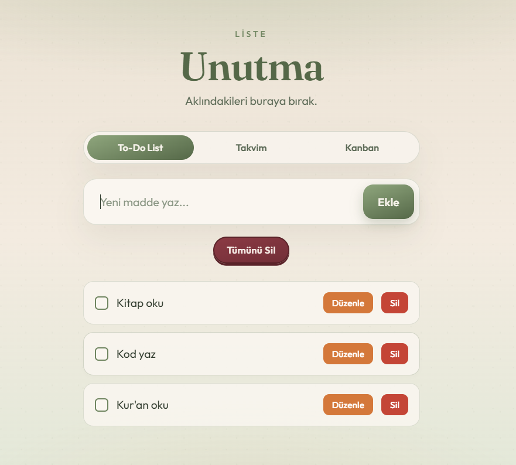
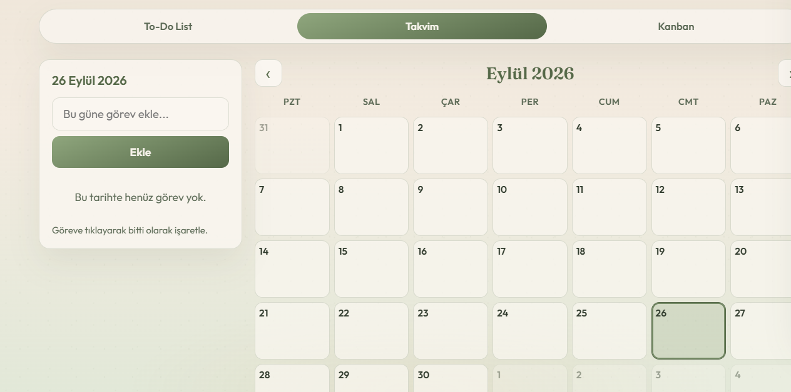
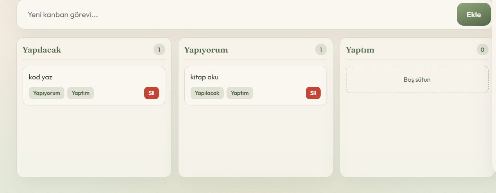
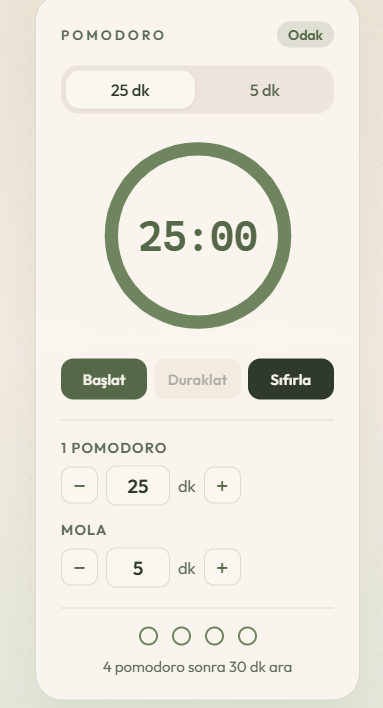

# 📝 Unutma - Kişisel Görev & Verimlilik Uygulaması

> **"Aklındakileri buraya bırak."**  
> **Unutma**, modern web teknolojileriyle geliştirilmiş; yapılacaklar listesi, takvim görünümü, Kanban panosu ve entegre Pomodoro odaklanma sayacını tek bir şık arayüzde birleştiren kapsamlı bir kişisel verimlilik ve görev yönetim uygulamasıdır.

---

## 📌 İçindekiler
- [✨ Özellikler](#-özellikler)
  - [📋 To-Do List (Görev Listesi)](#-to-do-list-görev-listesi)
  - [📅 Takvim Görünümü (Calendar View)](#-takvim-görünümü-calendar-view)
  - [📊 Kanban Panosu (Kanban Board)](#-kanban-panosu-kanban-board)
  - [⏱️ Pomodoro Odaklanma Zamanlayıcısı](#-pomodoro-odaklanma-zamanlayıcısı)
- [🛠️ Kullanılan Teknolojiler](#️-kullanılan-teknolojiler)
- [📁 Proje Dosya Yapısı](#-proje-dosya-yapısı)
- [🚀 Kurulum ve Çalıştırma](#-kurulum-ve-çalıştırma)
- [💾 Veri Saklama (LocalStorage)](#-veri-saklama-localstorage)
- [🎨 Tasarım ve Kullanıcı Deneyimi](#-tasarım-ve-kullanıcı-deneyimi)
- [🤝 Katkıda Bulunma](#-katkıda-bulunma)
- [📄 Lisans](#-lisans)

---

## ✨ Özellikler

### 📋 To-Do List (Görev Listesi)
* **Hızlı Görev Ekleme:** Giriş kutusuna yazıp `Enter` tuşuna basarak hızlıca görev oluşturabilirsiniz.
* **Canlı Düzenleme (In-Line Edit):** Görevin yanındaki *"Düzenle"* butonuna basarak veya görev üzerindeyken metni anında güncelleyebilirsiniz (`Enter` ile kaydet, `Esc` ile iptal et).
* **Görev Tamamlama:** Görevlerin yanındaki onay kutularıyla (checkbox) görevleri tamamlandı olarak işaretleyebilirsiniz.
* **Toplu Temizleme:** *"Tümünü Sil"* seçeneği ile listenizi tek tıkla sıfırlayabilirsiniz.



### 📅 Takvim Görünümü (Calendar View)
* **Dinamik Ay Navigasyonu:** Önceki ve sonraki aylara kolayca geçiş yapabilirsiniz.
* **Tarih Bazlı Planlama:** Takvim üzerindeki herhangi bir güne tıklayarak o güne özel görevler ekleyebilir ve takip edebilirsiniz.
* **Görsel Özet:** Takvim hücreleri üzerinde ilgili günlerde yer alan görevlerin özet etiketleri ve sayıları görüntülenir.
* **Bugün Vurgusu:** Mevcut gün otomatik olarak tespit edilir ve takvimde belirgin şekilde vurgulanır.



### 📊 Kanban Panosu (Kanban Board)
* **3 Aşamalı Süreç Takibi:**
  * 🟡 **Yapılacak:** Planlanan görevler.
  * 🔵 **Yapıyorum:** Şu an üzerinde çalışılan aktif görevler.
  * 🟢 **Yaptım:** Tamamlanan görevler.
* **Sürükle & Bırak (Drag & Drop):** Görev kartlarını fare ile sürükleyip sütunlar arasında kolayca taşıyabilirsiniz.
* **Hızlı Taşıma Butonları:** Alternatif olarak kart üzerindeki butonlar ile tek tıkla sütun değiştirebilirsiniz.
* **Canlı Sayaçlar:** Her sütunun başlığında o aşamadaki görev sayısı anlık olarak güncellenir.


### ⏱️ Pomodoro Odaklanma Zamanlayıcısı
* **Çift Mod Desteği:**
  * **Odaklanma (Focus):** Varsayılan 25 dakika (1-120 dk arasında özelleştirilebilir).
  * **Mola (Break):** Varsayılan 5 dakika (1-60 dk arasında özelleştirilebilir).
* **Uzun Mola Takibi:** 4 Pomodoro döngüsü tamamlandığında otomatik olarak 30 dakikalık uzun molaya geçiş uyarısı verir.
* **Dairesel İlerleme Çubuğu:** SVG tabanlı akıcı dairesel zaman sayacı ve geri sayım.
* **Web Audio API Sesli Bildirimler:** Süre başladığında ve bittiğinde tarayıcı tabanlı özgün ses efektleri çalar.
* **Masaüstü Bildirimleri (Browser Notifications):** Süre tamamlandığında masaüstünüze bildirim gönderir.


---

## 🛠️ Kullanılan Teknolojiler

* **HTML5:** Semantik etiketler ve drag-and-drop API entegrasyonu.
* **CSS3:** Glassmorphism arayüz efektleri, esnek CSS Grid / Flexbox düzeni, özel SVG animasyonları ve Google Fonts (`Outfit` & `Fraunces`).
* **JavaScript (ES6+):** Modüler ve olay odaklı (event-driven) saf JS mimarisi.
* **Web Audio API:** Harici ses dosyasına ihtiyaç duymadan sentetik başlangıç ve bitiş bildirim sesleri.
* **HTML5 LocalStorage:** Kullanıcı verilerini tarayıcıda yerel olarak saklama.

---

## 📁 Proje Dosya Yapısı

```txt
todo_app/
├── index.html        # Ana HTML yapısı ve uygulama sekmeleri
├── style.css         # Tüm stil tanımlamaları, fontlar ve animasyonlar
├── script.js         # To-Do, Takvim, Kanban ve Pomodoro mantığı (ES6+)
├── Pomodoro.jsx      # React/Next.js projelerinde kullanılabilen alternatif bileşen
└── README.md         # Proje dokümantasyonu
```

---

## 🚀 Kurulum ve Çalıştırma

Bu proje herhangi bir paket yöneticisi (`npm`/`yarn`) veya derleme adımı gerektirmez.

1. **Projeyi İndirin / Klonlayın:**
   ```bash
   git clone https://github.com/sinem12-ctrl/Unutma-todo-list-.git
   cd todo_app
   ```

2. **Uygulamayı Çalıştırın:**
   - `index.html` dosyasını favori web tarayıcınızda (Chrome, Firefox, Edge, Safari vb.) çift tıklayarak açabilirsiniz.
   - Alternatif olarak VS Code kullanıyorsanız **Live Server** eklentisi ile başlatabilirsiniz.

---

## 💾 Veri Saklama (LocalStorage)

Uygulamadaki tüm veriler tarayıcınızın `localStorage` alanında 3 farklı anahtarla saklanır:

| Veri Tipi | LocalStorage Anahtarı | Açıklama |
| :--- | :--- | :--- |
| **Görev Listesi** | `unutma-todos` | Standart yapılacaklar listesi maddeleri ve durumları |
| **Takvim Görevleri** | `unutma-calendar-tasks` | Tarihlere göre gruplanmış görev objeleri |
| **Kanban Görevleri** | `unutma-kanban-tasks` | Kart kimlikleri, metinleri ve sütun durumları |

> 💡 **Not:** Sayfayı yenileseniz veya tarayıcıyı kapatıp açsanız bile tüm verileriniz korunur.

---

## 🎨 Tasarım ve Kullanıcı Deneyimi

- **Tipografi:** Başlıklarda zarif `Fraunces` fontu, arayüz metinlerinde ise okunaklı `Outfit` fontu kullanılmıştır.
- **Glassmorphism:** Pomodoro panosu ve görünüm sekmelerinde yarı saydam yumuşak arka planlar ve gölgeler tercih edilmiştir.
- **Kullanıcı Dostu İnteraktivite:** Drag-and-drop efektleri, odak modları ve mikro animasyonlarla akıcı bir deneyim sunulmaktadır.

---

## 🤝 Katkıda Bulunma

Katkılarınız her zaman memnuniyetle karşılanır!

1. Bu depoyu çatallayın (Fork edin).
2. Yeni bir özellik dalı oluşturun (`git checkout -b ozellik/yeni-ozellik`).
3. Değişikliklerinizi işleyin (`git commit -m 'Yeni bir özellik eklendi'`).
4. Dalınıza gönderin (`git push origin ozellik/yeni-ozellik`).
5. Bir Çekme İsteği (Pull Request) oluşturun.

---

## 📄 Lisans

Bu proje [MIT Lisansı](LICENSE) altında lisanslanmıştır. Dilediğiniz gibi kullanabilir, geliştirebilir ve paylaşabilirsiniz.
